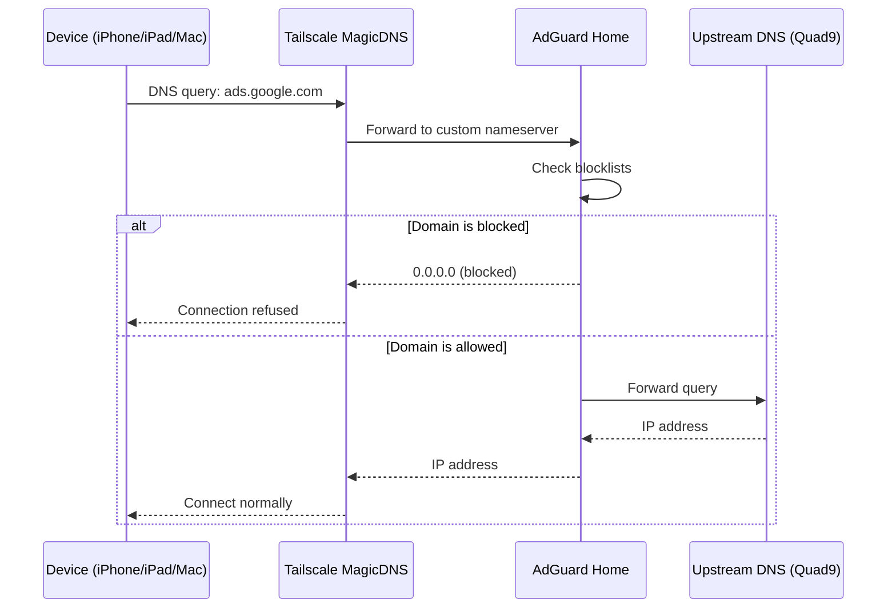

# DNS & Ad Blocking

**AdGuard Home** is our network-wide DNS server, providing ad blocking, tracker protection, and malware domain filtering for all devices on the Tailscale network.

## 🛡️ Role

While Tailscale provides the secure tunnel and NPM handles HTTP routing, AdGuard Home handles the **DNS layer** — intercepting and filtering domain lookups before connections are made.

- **Ad Blocking**: Blocks ads across all apps, browsers, and devices at the DNS level.
- **Tracker Protection**: Prevents telemetry and analytics domains from resolving.
- **Centralized Control**: Single dashboard to manage blocklists, allowlists, and query logs.

## 🛠️ How It Works

## 📋 Blocklists

| List | Domains |
| :--- | :--- |
| **AdGuard DNS filter** | ~164k domains |
| **AdAway Default Blocklist** | ~6.5k domains |

Additional lists can be added via **Filters → DNS Blocklists** in the admin UI.

## 🔧 Tailscale Integration

AdGuard is configured as the DNS server for the entire Tailnet:

1. **Tailscale Admin** → **DNS** → **Custom Nameserver**: homelab's Tailscale IP
2. **Override local DNS**: enabled

All tailnet devices automatically use AdGuard for DNS — no per-device configuration needed.

## 🍎 Apple Devices

iCloud Private Relay bypasses local DNS entirely. To ensure ad blocking works:

**iPhone/iPad**: Settings → Wi-Fi → tap your network → **Limit IP Address Tracking** → turn off

This only affects the home network — Private Relay stays active on cellular and public WiFi.

## 🔒 Security

- Port 53 (DNS) is exposed on the host for Tailscale reachability.
- The admin UI is proxied through NPM at [adguard.ts.debdut.in](http://adguard.ts.debdut.in).
- Config directory contains a bcrypt password hash and is **not tracked in Git**.
