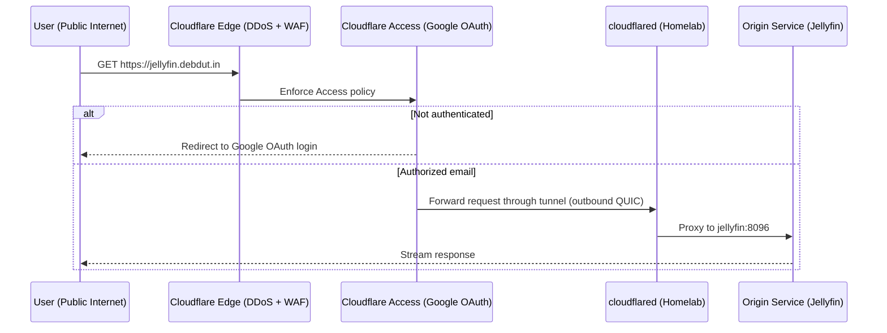

# Public Ingress (Cloudflare Tunnel)

While [Tailscale](tailscale.md) keeps the majority of services private, a small, deliberately-chosen subset is published to the public internet through a **Cloudflare Tunnel** — without opening a single port on the home router.

## 🌐 Role

The `cloudflared` connector makes an **outbound** QUIC connection to Cloudflare's edge. Cloudflare then routes inbound public requests back down that tunnel to the origin container. Your home IP is never exposed and no inbound firewall rules are required.

Currently published:

| Hostname | Origin | Purpose |
| :--- | :--- | :--- |
| `jellyfin.debdut.in` | `jellyfin:8096` | Public media streaming for trusted users |

## 🛠️ How It Works

## 🔒 Security Model

- **No Open Ports**: The tunnel is outbound-initiated, so the home router keeps zero inbound port forwards.
- **Identity-Gated**: Every public hostname sits behind a **Cloudflare Access** application requiring **Google OAuth SSO**, restricted to an explicit allowlist of email addresses. Unauthenticated traffic never reaches the origin.
- **Edge Protection**: Cloudflare's edge provides DDoS mitigation and WAF filtering before requests are tunnelled.
- **Hardened Connector**: The container drops all Linux capabilities (`cap_drop: ALL`) and runs with `no-new-privileges`, capped at 256 MB.

!!! note "Streaming Cache Bypass"
    Cloudflare caches media file extensions by default, which breaks video playback. A **Cache Rule** bypasses the cache for `jellyfin.debdut.in` so streams are served directly from the origin.

!!! warning "Browser-Only: Native Apps Are Not Supported Publicly"
    Cloudflare Access authenticates via an interactive **browser** OAuth flow and sets a `CF_Authorization` cookie on every request. Native clients (the Jellyfin mobile/TV apps, Kodi, etc.) cannot complete that handshake, so they are blocked at the edge. Over the public endpoint, **only the web browser works** — this is a deliberate trade-off in favour of the SSO gate. Native-app access requires the private [Tailscale](tailscale.md) path instead.

## ⚙️ Configuration

The tunnel is **remotely managed** — public hostnames, Access policies, and ingress rules live in the [Cloudflare Zero Trust dashboard](https://one.dash.cloudflare.com/), not in a local config file. The connector authenticates with a single `CLOUDFLARE_TUNNEL_TOKEN` injected from the host environment.

Domain `debdut.in` uses Cloudflare as its authoritative DNS; registration remains at GoDaddy. See `cloudflared/README.md` for the full one-time setup procedure.
