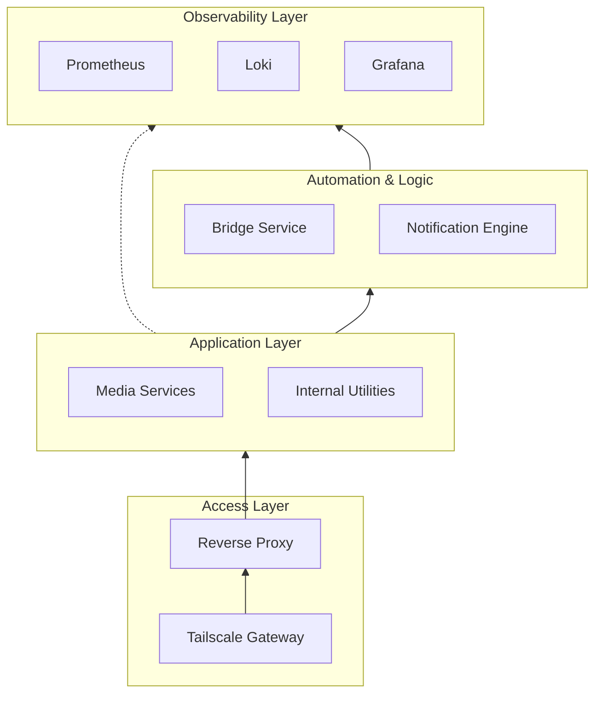

# Infrastructure Overview

Our homelab is designed as a modular, containerized ecosystem where each component is isolated yet interconnected through a secure, private network fabric.

## 🧱 Functional Layers

The infrastructure is organized into distinct logical layers to ensure separation of concerns and high availability.

| Layer | Responsibility | Key Technologies |
| :--- | :--- | :--- |
| **Connectivity** | Secure ingress and mesh networking | Tailscale, WireGuard |
| **Routing** | Service discovery and SSL termination | Nginx Proxy Manager |
| **Observability** | Metrics, logs, and alerting | Prometheus, Grafana, Loki |
| **Automation** | Intelligent event handling | Bridge, Apprise |
| **Application** | User-facing services | Jellyfin, Servarr Stack |

## 🏗️ Conceptual Architecture

The following diagram illustrates how the layers interact to provide a seamless and secure experience.

## 🛠️ Unified Management

Management of the entire stack is handled through a centralized Command Line Interface (CLI). This interface abstracts the complexity of individual container operations into high-level lifecycle commands:

-   **Deployment**: Orchestrates the startup sequence, ensuring networking is healthy before launching dependent services.
-   **Maintenance**: Handles image updates, configuration reloads, and state persistence.
-   **Diagnostics**: Provides unified log streaming and real-time health telemetry across all layers.
