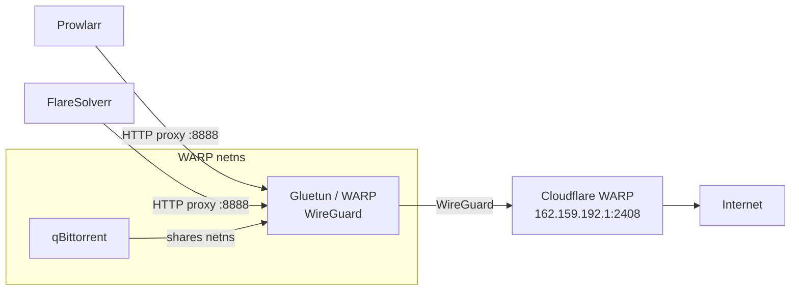

# Egress VPN (Cloudflare WARP)

The download stack routes all of its outbound traffic through **Cloudflare WARP** over WireGuard, isolating torrent and indexer egress from the host's home IP.

## 🛰️ Role

WARP runs via [Gluetun](https://github.com/qdm12/gluetun) as a custom WireGuard client connecting to Cloudflare's WARP endpoint. It provides:

- **Anycast Egress IP**: Outbound traffic exits from Cloudflare's WARP anycast address, not the home broadband IP.
- **Netns Sharing**: **qBittorrent** runs inside the WARP container's network namespace, so *all* torrent traffic is forced through the tunnel — if WARP drops, qBittorrent loses connectivity (a built-in kill-switch).
- **HTTP Proxy**: An HTTP proxy on port `8888` lets **Prowlarr** and **FlareSolverr** send indexer requests through WARP as well.

## 🛠️ Architecture

## 📡 Exposed Ports

Because qBittorrent lives in the WARP namespace, its ports are published on the WARP container:

| Port | Purpose |
| :--- | :--- |
| `8081` | qBittorrent WebUI (reached internally at `warp:8081`) |
| `6882` (TCP/UDP) | BitTorrent peer connections |
| `8888` | HTTP proxy for Prowlarr / FlareSolverr |

## 🔒 Notes

- WireGuard keys (`WARP_WG_PRIVATE_KEY`) are generated with `wgcf` and injected from the host environment; the `wgcf-account.toml` / `wgcf-profile.conf` are kept out of Git.
- `FIREWALL_OUTBOUND_SUBNETS` permits the internal `172.18.0.0/16` bridge so the WebUI stays reachable to other homelab containers.
- Health is verified by confirming outbound reachability (`api.ipify.org`) through the tunnel.
