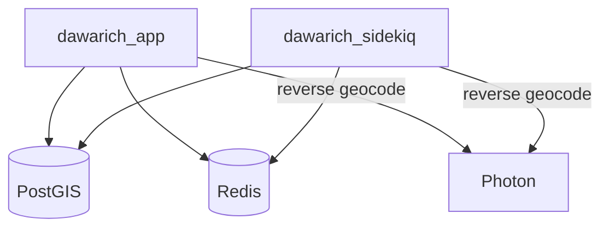

# Location Timeline (Dawarich)

**Dawarich** is a self-hosted replacement for Google Timeline / Location History — it ingests location data from your devices and renders a private, searchable map of where you've been, entirely on your own infrastructure.

## 🗺️ Role

- **Timeline**: Visualise trips, visits, and travel history on an interactive map.
- **Ingestion**: Accepts location points from mobile apps (e.g. OwnTracks / GPSLogger) and imports from Google Takeout.
- **Self-Hosted Geocoding**: Reverse-geocoding is served locally by a **Photon** instance (India region) — no third-party geocoding calls.
- **Access**: [dawarich.ts.debdut.in](http://dawarich.ts.debdut.in)

## 🧩 Components

| Container | Role |
| :--- | :--- |
| `dawarich_app` | Rails web application (UI + API) |
| `dawarich_sidekiq` | Background job processing (imports, stats) |
| `dawarich_db` | PostgreSQL + PostGIS spatial database |
| `dawarich_redis` | Job queue and cache |
| `photon` | Local reverse-geocoding engine |

## 🛠️ Architecture

## 🔒 Privacy & Security

- Only `dawarich_app` joins the shared `homelab` network for proxying; the database, redis, sidekiq worker, and Photon stay on an **isolated internal `dawarich` network**.
- `STORE_GEODATA=true` with a local Photon means location data never leaves the homelab.
- All containers run with dropped capabilities and `no-new-privileges`.

!!! note "Photon Footprint"
    Photon holds a regional geocoding index in memory (~300 MB resident, 1 GB cap) and updates on a 720-hour cycle. It's the heaviest single container in this stack.
