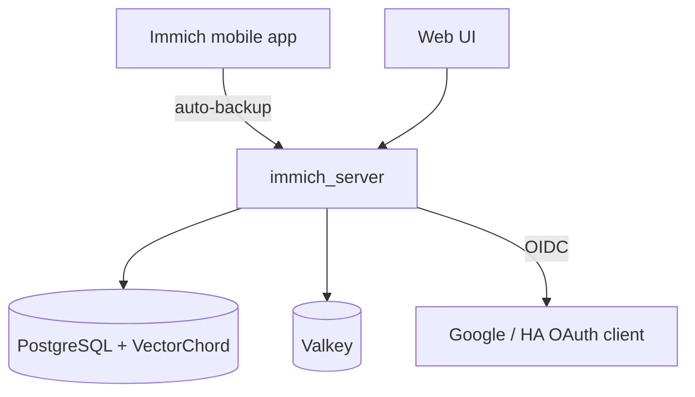

# Photo Library (Immich)

**Immich** is a self-hosted, high-performance photo and video library — a private replacement for Google Photos. It backs up the camera roll from mobile devices and provides a fast timeline, albums, search, and a map, entirely on the homelab.

## 📸 Role

- **Mobile Backup**: The official Immich app auto-backs-up phones (the primary use case).
- **Timeline & Albums**: Browse by date, organise into albums, view Memories.
- **Map**: Photos with GPS are plotted; place names come from a bundled offline geocoder.
- **Bulk Import**: Historical libraries (e.g. Google Takeout) are imported via [`immich-go`](https://github.com/simulot/immich-go).
- **Access**: [immich.ts.debdut.in](http://immich.ts.debdut.in)

## 🧩 Components

| Container | Role |
| :--- | :--- |
| `immich_server` | API, web UI, **and** background jobs (thumbnails, metadata, transcode) |
| `immich_postgres` | PostgreSQL with the VectorChord extension (pinned image) |
| `immich_redis` | Valkey — job queue |

!!! note "No Machine-Learning container — by design"
    The `immich-machine-learning` service is deliberately omitted (and disabled via `IMMICH_MACHINE_LEARNING_ENABLED=false`) to protect the 16 GB Mac mini. **Lost:** smart/semantic search, face recognition, visual duplicate detection. **Kept:** upload, timeline, albums, sharing, and the **map** (which uses EXIF GPS + a bundled geocoder, not ML). Re-enabling it on this box would add hundreds of thousands of CPU-heavy jobs.

## 🛠️ Architecture

## 🔐 Authentication

- **Google OIDC only** — password login is **disabled**; the login page **auto-launches** straight to Google.
- Reuses the existing **Home Assistant Google OAuth client** (Google is the OIDC provider, issuer `accounts.google.com`).
- Config lives in a **config file** (`immich-config.json` via `IMMICH_CONFIG_FILE`), not the UI — so it survives a database wipe.

!!! warning "Lockout recovery"
    Because sign-in is Google-only, if OAuth breaks: open `https://immich.ts.debdut.in/auth/login?autoLaunch=0` to reach the login page, set `passwordLogin.enabled: true` in `immich-config.json` and `make up immich`, then `docker exec -it immich_server immich-admin reset-admin-password`.

## 🗂️ Storage

- Originals live under `immich/data/upload/` on the external disk, organised by a **date-based storage template** (`{{y}}/{{y}}-{{MM}}-{{dd}}/{{filename}}`) — so the archive is human-browsable on disk, independent of the database.
- A **per-user quota** is set (via the DB `quotaSizeInBytes`) — this also gives a meaningful "used" figure, since the raw disk-capacity widget misreads OrbStack's virtiofs mount and shows a bogus (inflated) total.

!!! note "Config file locks the Settings UI"
    Setting `IMMICH_CONFIG_FILE` makes the **entire** admin Settings UI read-only. To change a setting, edit `immich-config.json` (a partial config that merges over defaults) and `make up immich`, or temporarily comment out the env + mount.

## 💾 Backups

Immich data is split across the two backup tiers (see [Backups](../operations/backrest.md)):

| Data | Where | Why |
| :--- | :--- | :--- |
| Photo/video **originals** (`upload/library`) | **Backblaze B2** | Bulk, irreplaceable — kept out of the config repo |
| **DB dumps** (`upload/backups`) + `immich-config.json` | **Cloudflare R2** | Albums, faces, metadata, users — small, critical curation |
| `thumbs/`, `encoded-video/`, live Postgres dir | **neither** | Regeneratable / unsafe-to-copy-hot |

On restore: originals from B2 + the DB dump from R2 reconstruct the full library; thumbnails and transcodes regenerate on demand.

## 🔒 Security

- `immich_postgres` and `immich_redis` stay on an isolated internal `immich` network; only `immich_server` joins the shared `homelab` network for proxying.
- `no-new-privileges` on all containers; Postgres runs with `--data-checksums`.
- Reached only via Nginx Proxy Manager over Tailscale (WebSockets enabled — required, or the UI shows "Server Offline").
