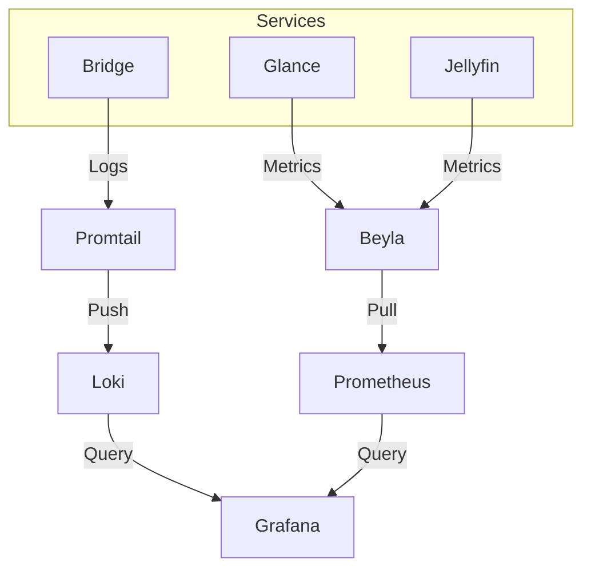

# Monitoring Stack

Our monitoring stack provides deep visibility into the health and performance of all homelab services, from hardware metrics to application-level traces.

## 📊 Overview

The stack is built on the **LGTM** (Loki, Grafana, Tempo, Mimir) philosophy, optimized for a single-node homelab environment.

| Component | Role |
| :--- | :--- |
| **Prometheus** | Metric collection and time-series database. |
| **Grafana** | Central visualization and alerting dashboard. |
| **Loki** | Log aggregation and indexing. |
| **Promtail** | Log shipping agent for Docker containers. |
| **Beyla** | eBPF-based auto-instrumentation for HTTP/gRPC services. |
| **JSON Exporter** | Scrapes custom APIs (e.g., Speedtest Tracker). |

## 🛠️ Architecture

## 🚨 Alerting

Alerting is handled through centralized configuration files that are automatically provisioned into Grafana.

- **High CPU/Memory**: Triggers if a container exceeds 90% allocation for 5 minutes.
- **Service Down**: Triggers if a healthcheck fails for 2 consecutive polls.
- **Notification Routing**: Alerts are routed via **Apprise** to Telegram.
